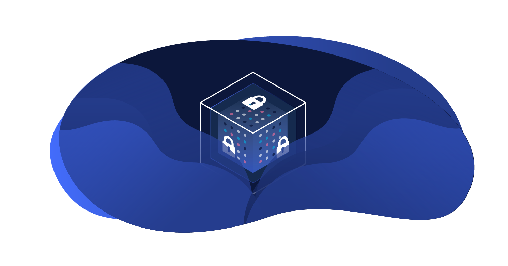

# Advanced Security powered by Patchstack

The Advanced Security module helps you keep track of all the dependencies of your site. It provides a dashboard that shows you 
any security alerts related to the plugins and themes you have used to build your site.

We have partnered with Patchstack to provide this service. Patchstack is the world's largest vulnerability discloser with over 
10,000 vulnerabilities in their database. 

## How it works

- scans during build
- presents information in the dashboard
- if firewall mitigation is enabled, it will also provide virtual patching for the vulnerabilities found
- 

### Known Vulnerability alerts

- describe how it looks in the dashboard
- 
### Virtual Patching Protection

- overview of this 
- advise to update plugins when available
- 
