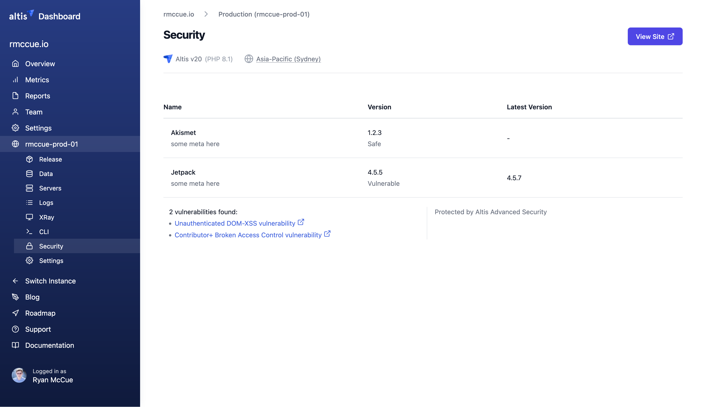

# Advanced Security powered by Patchstack


Enterprise sites on the web can be a big target for potential hackers, so ensuring a high level of security is critical. Altis
is built from the ground up for [security-by-design](docs://security/) of the platform, but we're always working hard to help
improve customer security on the platform too.

The Advanced Security module helps you keep track of all the dependencies of your site. It provides a dashboard that shows you
any security alerts related to the plugins and themes you have used to build your site.

Although we still recommend you use [GitHub Dependabot](docs://guides/automatic-updates.md) to keep your dependencies up to date,
this module provides an additional layer of security by alerting you to known vulnerabilities in your plugins and themes. It also
provides virtual patching for these vulnerabilities if you have the firewall mitigation enabled.

We have partnered with Patchstack to provide this service. Patchstack is one of the largest open-source vulnerability
disclosers in the world with over 30,000 vulnerabilities in their database.

## How it works

Every time you build your site, the Advanced Security module will scan your plugins and themes for known vulnerabilities. If any
known vulnerabilities are found, they will be presented in the dashboard. This is done at build time so that you have a chance
to update your plugins and themes _before_ you deploy the new build to production.

If you have the firewall mitigation enabled, the module will also provide virtual patching for the vulnerabilities found.
This means that even if you can't update a plugin or theme immediately, the firewall will help protect your site from known
vulnerabilities when you deploy your build to production.

### Known Vulnerability alerts

When the module finds a known vulnerability in one of your plugins or themes, it will display an alert in the dashboard. The alert
will look something like this.



The alert will show you a list of all your plugins and themes. It will indicate the version in your build, if different, and any
known vulnerabilities. There will be a link to more information about the vulnerabilities. You can click on the link to view more
details about the vulnerability, including the CVE ID, a description of the vulnerability, and the fixed version number without the
vulnerability.

### Virtual Patching Protection

Patchstack vPatching auto-mitigates security vulnerabilities even when there's no official patch available. It's the fastest and
most effective way to eliminate new security vulnerabilities without sacrificing performance.

## How to configure Advanced Security

**Your subscription**: Altis Advanced Security is an add-on to your existing Altis environments, and is not included as a
standard part of your subscription. Contact your account manager for more information about adding Advanced Security to your
subscription.

Once you have a license, enable the module in your `composer.json` file.

```json
{
    "require": {
        "altis/advanced-security": "^23.0.0"
    }
}
```

or run

```shell
composer require altis/advanced-security:^23.0.0
```

When you push these changes to your repository and build your app, Advanced Security will be enabled on your environment.


